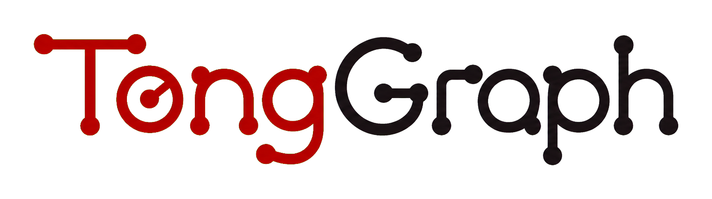

# TongGraph

<p align="center">
  
</p>

TongGraph is a lightweight embedded graph compute database for Python applications that need local GraphRAG retrieval, AI memory, agent context graphs, and probabilistic graph reasoning. TongGraph is for applications that want fast local graph structure, persistence, traversal, algorithms, and inference without running a separate database service.

## Feature Highlights

- Property graph model with labels, typed edges, scalar properties, and external IDs.
- Rust core exposed through a compact Python SDK.
- Local SQLite persistence with reopen, indexes, snapshots, and compute segment
  compaction.
- Traversal and analytics APIs for neighbors, k-hop retrieval, BFS, shortest
  path, connected components, PageRank, random walks, subgraphs, and batch jobs.
- Structured path-query DSL plus a provider-neutral natural-language compiler
  hook.
- Named full-text indexes for node and edge properties with Unicode word search,
  trigram substring search, filters, and snapshot reads.
- Embedded Cypher compatibility subset for local `MATCH`, `CREATE`, `MERGE`,
  `SET`, `REMOVE`, `DELETE`, `DETACH DELETE`, `RETURN`, parameters, and staged
  transactions.
- Probabilistic graph layer with variables, CPDs, factor tables, evidence,
  active-subgraph belief propagation, posteriors, and traces.
- Reproducible Python benchmark scripts for graph algorithms and belief
  propagation.

## Getting Started

Install tonggraph with [uv](https://docs.astral.sh/uv/) (recommended):

```bash
uv add tonggraph
```

or pip:

```bash
pip install tonggraph
```

For local development, run:

```bash
git clone https://github.com/bigai-nlco/TongGraph.git
cd TongGraph
uv sync --dev
uv run python scripts/build_python_extension.py
```

Verify the package:

```bash
uv run python -c "from tonggraph import Graph; print(Graph().node_count())"
```

Create a small graph:

```python
from tonggraph import Graph

graph = Graph()
alice = graph.add_node(
    "alice",
    labels=["Person"],
    properties={"name": "Alice", "active": True},
)
bob = graph.add_node("bob", labels=["Person"], properties={"name": "Bob"})
graph.add_edge(alice, bob, "KNOWS", properties={"weight": 0.8})

print(graph.neighbors(alice))
print(graph.k_hop(alice, 1))
```

Use local persistence by passing a SQLite path:

```python
graph = Graph("memory.db")
graph.add_node("session:1", labels=["Session"])
graph.compact()

reopened = Graph("memory.db")
print(reopened.node_count())
```

Run the Python tests and benchmark scripts:

```bash
uv run pytest
uv run python scripts/benchmark_algorithms.py --nodes 1000 --degree 4 --repeat 2
uv run python scripts/benchmark_belief_propagation.py --nodes 1000 --degree 4 --repeat 2
```

## Documentation

- [Quickstarts](docs/quickstart/index.md)
- [Core concepts](docs/core-concepts.md)
- [Examples](docs/examples/index.md)

## Development

Before setting up the repository, install:

- Python 3.10 or newer
- [uv](https://docs.astral.sh/uv/getting-started/installation/) for the Python
  environment and Python dependencies
- A stable Rust toolchain, including `rustc` and `cargo`, preferably installed
  with [rustup](https://rustup.rs/)
- A C/C++ build toolchain and the SQLite development library

On Ubuntu or Debian, install the native build dependencies with:

```bash
sudo apt update
sudo apt install -y build-essential libsqlite3-dev
```

On macOS, install the Xcode command-line tools. SQLite is normally provided by
the operating system:

```bash
xcode-select --install
```

On Windows, install Rust with the MSVC toolchain, the Visual Studio C++ Build
Tools, and SQLite development libraries that are visible to the linker.
Alternatively, use WSL and follow the Ubuntu instructions above.

For Linux, macOS, or WSL, install Rust through `rustup` with:

```bash
curl --proto '=https' --tlsv1.2 -sSf https://sh.rustup.rs | sh
source "$HOME/.cargo/env"
```

Verify the required tools before continuing:

```bash
python --version
uv --version
rustc --version
cargo --version
```

`uv` manages the Python virtual environment and Python packages. It does not
install the Rust toolchain, compiler toolchain, or SQLite development library.

Install development dependencies and build the local extension in place:

```bash
uv sync --dev
uv run python scripts/build_python_extension.py
```

Run the test and documentation checks:

```bash
uv run pytest
uv run mkdocs build --strict
```
