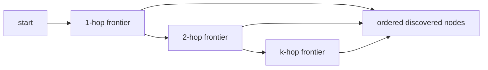

# Algorithms

TongGraph exposes graph algorithms as Python methods while executing them in the
Rust core. The algorithms operate on internal integer node IDs and can filter by
edge direction and edge type where supported.

## Neighbor Expansion

The primitive operation is neighbor collection:

\[
N(v, d, t) = \{u \mid (v,u) \in E \text{ for direction } d \text{ and optional type } t\}
\]

The implementation reads edge IDs from compacted outgoing/incoming segments and
the mutable delta overlay, then returns unique neighbor node IDs in deterministic
order.

API references:
[`neighbors`](../api/graph.md#tonggraph.Graph.neighbors),
[`k_hop`](../api/graph.md#tonggraph.Graph.k_hop),
[`frontier`](../api/graph.md#tonggraph.Graph.frontier).

## K-Hop Traversal

`k_hop(start, hops)` performs breadth-first expansion up to `hops` steps and
returns nodes when they are first discovered, excluding the start node.



The `frontier(starts, steps)` variant returns only the last frontier, which is
useful for layered neighborhood queries.

## Breadth-First Search

[`bfs`](../api/graph.md#tonggraph.Graph.bfs) returns nodes in visit order and accepts
an optional `max_depth`.

\[
\text{visit}(u) \quad \text{when} \quad \operatorname{dist}(start,u) \leq max\_depth
\]

The current implementation is deterministic because neighbor collection is
deduplicated before adding nodes to the queue.

## Weighted Shortest Path

[`shortest_path`](../api/graph.md#tonggraph.Graph.shortest_path) uses Dijkstra-style
relaxation when `weight_property` is supplied. Missing weights default to `1.0`;
provided weights must be finite and non-negative.

\[
d(v) = \min_{(u,v) \in E} d(u) + w(u,v)
\]

The result is either:

```python
{"nodes": [source, ..., target], "distance": 1.5}
```

or `None` when the target is unreachable.

## Connected Components

[`connected_components`](../api/graph.md#tonggraph.Graph.connected_components) treats
edges as undirected by expanding both incoming and outgoing adjacency. An
optional edge-type filter can restrict the graph before component discovery.

## PageRank

[`pagerank`](../api/graph.md#tonggraph.Graph.pagerank) iteratively updates ranks over
outgoing edges with damping and dangling-node redistribution:

\[
r_{next}(v) = \frac{1-\alpha}{|V|}
  + \alpha \frac{\sum_{u \in D} r(u)}{|V|}
  + \alpha \sum_{u \rightarrow v} \frac{r(u)}{\operatorname{outdeg}(u)}
\]

Where \(\alpha\) is `damping` and \(D\) is the set of dangling nodes. If
`tolerance` is provided, iteration stops when the L1 difference between ranks is
small enough.

## Random Walk

[`random_walk`](../api/graph.md#tonggraph.Graph.random_walk) repeatedly samples one
neighbor from the current node. Supplying `seed` makes the path reproducible for
testing and examples.

## Sparse Probability Transfer

[`propagate`](../api/graph.md#tonggraph.Graph.propagate) transfers score mass along
outgoing edges:

\[
p_{t+1}(v) = \sum_{u \rightarrow v} p_t(u) \cdot w(u,v) \cdot \gamma
\]

where `edge_property` supplies \(w\), `edge_type` can restrict traversal to one
edge type, and `damping` supplies \(\gamma\). Results accumulate seed and
transferred mass across steps.

[`local_propagate`](../api/graph.md#tonggraph.Graph.local_propagate) first compiles a
radius-limited active node set and only transfers mass inside that set.

## Batch Compute

[`compute_batch`](../api/graph.md#tonggraph.Graph.compute_batch) accepts a list of job
dictionaries and returns results in the same order. It supports:

- `bfs`
- `shortest_path`
- `connected_components`
- `pagerank`
- `random_walk`
- `subgraph`

Use batch compute when a caller needs several graph computations against the
same graph state and wants a single Python-to-Rust call boundary.
