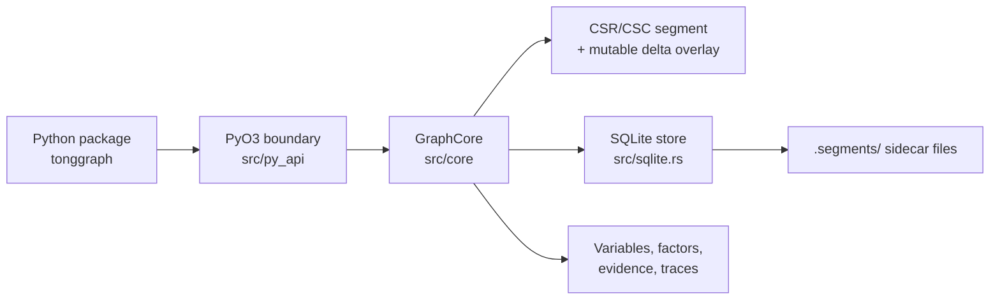

# Architecture

TongGraph separates the Python API, Rust graph core, local storage, compacted
compute segments, and probabilistic inference metadata.

## Runtime Layers

| Layer | Responsibility | Python-facing reference |
|---|---|---|
| `python/tonggraph` | Imports the compiled extension and exposes public classes. | [`Graph`](../api/graph.md#tonggraph.Graph) |
| `src/py_api` | Converts Python values to Rust models and Rust results back to Python. | [`Graph.add_node`](../api/graph.md#tonggraph.Graph.add_node) |
| `src/core` | Owns graph records, indexes, traversal, algorithms, segments, and inference. | [`Graph.bfs`](../api/graph.md#tonggraph.Graph.bfs) |
| `src/sqlite.rs` | Persists records, property catalogs, operation logs, posteriors, and segment manifests. | [`Graph.open`](../api/graph.md#tonggraph.Graph.open) |

## Data Flow

1. Python calls a method such as `Graph.add_edge(...)`.
2. PyO3 parses Python scalars and dictionaries into internal Rust records.
3. `GraphCore` validates IDs, edge types, labels, and property values.
4. If a SQLite store is attached, the record is written to local tables and an
   operation log entry is appended.
5. The in-memory indexes and mutable adjacency overlay are updated.
6. Traversal and algorithm calls read from both compacted segments and the delta
   overlay.

## Compute-Native Storage

TongGraph stores graph objects as records, but traversal uses edge IDs in
outgoing and incoming adjacency structures. Compaction rebuilds immutable
segments from current edges and clears the mutable delta overlay.

!!! info "Why this split matters"
    The local database gives restartable metadata and property lookup. The
    adjacency segment gives fast graph traversal without projecting data into a
    second compute representation at query time.

## Snapshot Semantics

[`Graph.snapshot`](../api/graph.md#tonggraph.Graph.snapshot) returns a copy of current
state without a persistence handle. The snapshot supports read and compute
methods such as `neighbors`, `bfs`, `shortest_path`, and `compute_batch`, but it
does not mutate the original graph.

## Design Boundaries

- Properties are stored as scalar values: `bool`, `int`, `float`, or `str`.
- Direction filters are parsed at the core boundary and support outgoing,
  incoming, or both-direction traversal.
- Probabilistic variables are not inferred from properties; they are created
  explicitly with [`add_variable`](../api/graph.md#tonggraph.Graph.add_variable).
- SQLite is the default implemented backend. LMDB, RocksDB, and custom segment
  backends are roadmap items rather than current public APIs.
