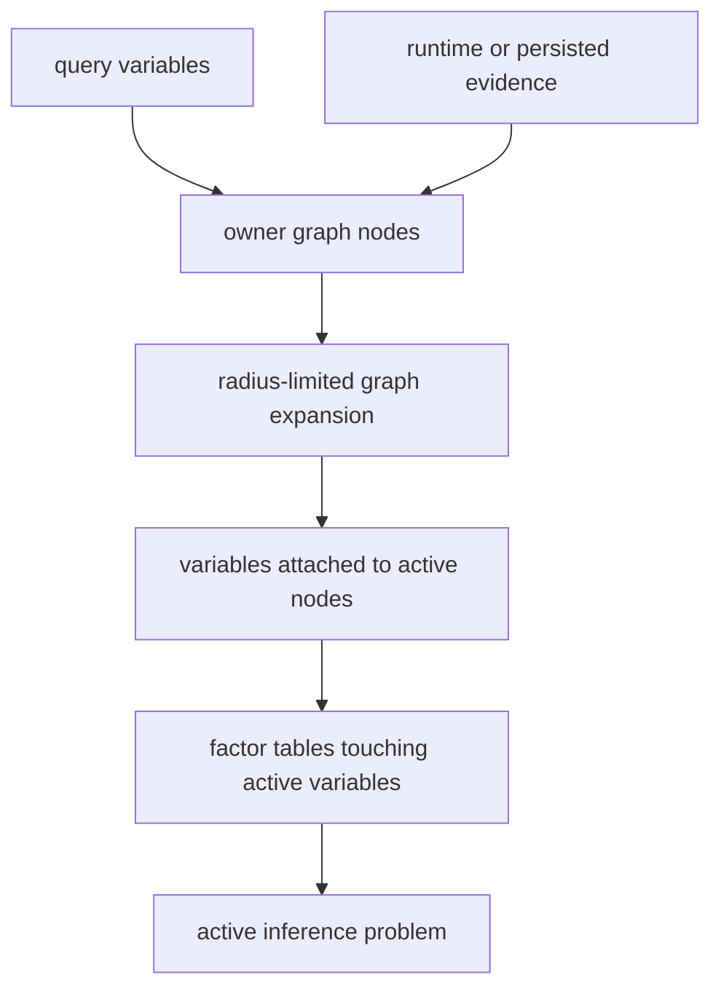

# Belief Propagation

TongGraph's probabilistic extension is finite and discrete. It supports binary
variables, categorical variables with explicit ordered states, factor tables,
CPDs, runtime evidence, persisted evidence, posteriors, and inference traces.

!!! note "Probabilities are explicit"
    Graph properties can store weights, but probabilistic inference only uses
    variables and factors created through the inference APIs.

## Model Objects

| Concept | API | Purpose |
|---|---|---|
| Variable | [`add_variable`](../api/graph.md#tonggraph.Graph.add_variable) | Defines a domain, ordered states, optional owner node, prior, and posterior metadata. |
| Factor table | [`add_factor_table`](../api/graph.md#tonggraph.Graph.add_factor_table) | Adds a dense potential table over ordered variables. |
| CPD | [`add_cpd`](../api/graph.md#tonggraph.Graph.add_cpd) | Adds a conditional probability table for one child variable and parent variables. |
| Evidence | [`add_evidence`](../api/graph.md#tonggraph.Graph.add_evidence) and runtime `evidence={...}` | Fixes variables to observed states. |
| Posterior | [`posterior`](../api/graph.md#tonggraph.Graph.posterior) | Reads persisted posterior, explicit posterior metadata, or prior fallback. |

## Active Subgraph Compilation

[`compile_active_subgraph`](../api/graph.md#tonggraph.Graph.compile_active_subgraph)
limits inference to variables and factors near query variables and evidence.



The returned dictionary includes `variables`, `factors`, `graph_nodes`,
`boundary_variables`, and `truncated`.

## Sum-Product Messages

For a variable \(x\), factor \(f\), prior \(\phi_x\), evidence indicator
\(\mathbb{1}_e\), and factor potential \(\psi_f\):

\[
m_{x \rightarrow f}(x)
  \propto \phi_x(x)\mathbb{1}_e(x)
  \prod_{g \in N(x) \setminus f} m_{g \rightarrow x}(x)
\]

\[
m_{f \rightarrow x}(x)
  \propto
  \sum_{\mathbf{y}=N(f)\setminus x}
  \psi_f(x, \mathbf{y})
  \prod_{y \in \mathbf{y}} m_{y \rightarrow f}(y)
\]

Beliefs are normalized products of priors, evidence, and incoming factor
messages:

\[
b_x(x) \propto \phi_x(x)\mathbb{1}_e(x)\prod_{f \in N(x)}m_{f \rightarrow x}(x)
\]

## Residual Asynchronous Schedule

[`belief_propagation`](../api/graph.md#tonggraph.Graph.belief_propagation) uses a
residual asynchronous schedule:

1. Initialize variable-to-factor and factor-to-variable messages uniformly.
2. Compute candidate updates for all active message directions.
3. Pick the candidate with largest L1 residual.
4. Apply damping:

   \[
   m_{new} = normalize((1-d)\cdot m_{candidate} + d\cdot m_{old})
   \]

5. Stop when residual is below `tolerance` or `max_iters` is reached.

The result dictionary exposes `schedule`, `iterations`, `messages_updated`,
`converged`, `max_residual`, `trace_id`, `active`, and `beliefs`.

## CPD Table Ordering

`add_cpd(child, parents, values)` stores variables in `[child, *parents]`.
Values are grouped by parent assignment, with the child state varying fastest.
For a binary child with one binary parent:

```python
graph.add_cpd(child, [parent], [0.9, 0.1, 0.2, 0.8])
```

This means:

| Parent state | P(child=false) | P(child=true) |
|---|---:|---:|
| `false` | 0.9 | 0.1 |
| `true` | 0.2 | 0.8 |

## Persistence

With `persist=True`, posterior vectors are stored in the SQLite-backed graph and
a trace record is added. Reopening the graph restores the latest posterior.
