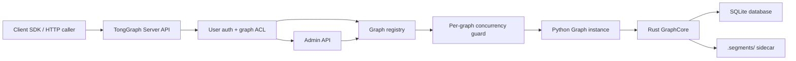

# Local Server

TongGraph currently runs as an embedded Python package: applications import the
package, create a `Graph`, and call the Rust-backed engine in the same process.
A local server would add an optional network access layer around that embedded
engine so other processes, tools, and clients can use TongGraph without loading
the Python package directly.

!!! note "Implementation status"
    The local server implementation is available as the optional
    `tonggraph[server]` extra. It provides a single-node HTTP API with token
    authentication, graph-level access control, administrator graph creation,
    auth management with token rotation, persisted server control-plane state,
    core storage/retrieval/query
    endpoints, bulk record and vector writes, context retrieval, controlled
    import/export, traversal and runtime algorithms, batch compute, TTL-bound
    read-only snapshots with retrieval endpoints, inference endpoints for probability transfer and
    belief propagation, local graph backup/restore, bare-metal deployment
    assets, a synchronous Python HTTP client, and basic operations support for
    request logging, JSON metrics, and request timeout handling.

## Goal

The server should make TongGraph available as a single-node local or internal
network service while preserving its single-machine storage model. It should be
useful for local applications, agent systems, GraphRAG tools, and cross-language
clients that need shared graph storage and retrieval.

The first multi-user target is an internal deployment, not a public SaaS
database: the server may identify users, map users to allowed graphs, and grant
read or write access per graph, while all graph files still live on one machine.
Administrators should be able to create graphs dynamically through management
APIs, with paths constrained under the configured data directory.

The server should be distributed as an optional Python extra such as
`tonggraph[server]` so embedded-only users do not install server dependencies.
It is not intended to replace the embedded SDK. Instead, both modes should share
the same core implementation:

```text
TongGraph core / Python SDK
        |
        +-- embedded mode: application imports tonggraph directly
        |
        +-- server mode: tonggraph-server imports tonggraph and exposes an API
```

## Product Boundary

The first server should be a local or internal-network service wrapper, not a
distributed graph database or public managed database service.

In scope:

- HTTP access to graph storage, retrieval, and query APIs.
- One service process managing one or more SQLite-backed `Graph` instances.
- Local filesystem persistence through the existing SQLite database and
  `.segments/` sidecar files.
- Configured graph names and administrator-created graph names instead of
  arbitrary client-selected filesystem paths.
- Internal multi-user access through configured users, tokens, and graph-level
  permissions.
- Administrator APIs for graph creation and graph permission management.
- JSON request and response bodies for client compatibility.
- Operational endpoints for health checks, graph lifecycle, compaction, refresh,
  local backup/restore, and controlled server-side import/export.

Out of scope for the first server:

- Distributed storage, replication, consensus, or clustering.
- Public multi-tenant database hosting.
- Built-in embedding generation or model-provider calls.
- Approximate nearest-neighbor search such as HNSW.
- A complete remote Cypher database protocol.
- Fine-grained authorization over individual nodes, edges, labels, or
  properties.
- Billing, quotas, tenant provisioning, or other public cloud control-plane
  features.

## Architecture



The server keeps a registry of opened graphs. Each graph entry owns its
configured name, lifecycle state, and a dedicated worker thread. The worker
creates and owns the `Graph(path)` handle so PyO3 graph objects are never sent
across threads. Graph operations are submitted to that worker and therefore run
serially per graph.

This model avoids many independent client processes opening the same SQLite file
for writes. The current persistence layer supports stale-handle detection and
`refresh()`, but a server can provide a cleaner operational boundary by making
the service process the single writer for each managed graph.

Snapshots are in-memory server resources owned by the per-graph worker thread.
Clients create a snapshot and receive a `snapshot_id`; reads, structured query,
read-only Cypher, and compute endpoints can then run against that stable view
until the snapshot expires or is deleted. Snapshot resources are not persisted
to `server-state.json` and do not survive server restart.

## Implementation Layout

The server should live under the Python package as an optional extra, not in the
Rust core. The first implementation should wrap the existing Python `Graph` API
and keep HTTP, authentication, access control, lifecycle management, and JSON
serialization in Python.

Recommended package layout:

```text
python/tonggraph/server/
  __main__.py          # python -m tonggraph.server
  cli.py               # tonggraph-server entry point
  app.py               # ASGI app factory
  config.py            # config loading and path validation
  auth.py              # token identity
  access.py            # graph ACL checks
  registry.py          # graph workers, dynamic graph creation, server-state
  errors.py            # stable error mapping
  schemas.py           # request/response models
  serialization.py     # SDK records to JSON-compatible objects
  routes/              # health, admin, records, retrieval, query, compute
  client.py            # Python HTTP client
```

The package metadata should expose server dependencies through
`tonggraph[server]` and a console script such as `tonggraph-server`. Embedded SDK
users should not need to install FastAPI/Uvicorn or other server-only
dependencies.

The Python HTTP client uses the standard library HTTP stack and returns
JSON-compatible dictionaries and lists. It can be imported from
`tonggraph.server.client` without constructing the FastAPI application.

## API Shape

The API should map closely to the embedded Python SDK. A caller that knows
`Graph.add_node()`, `Graph.search_text()`, `Graph.search_vector()`, or
`Graph.query()` should be able to recognize the corresponding server operation.

Expected API groups:

| Group | Examples |
|---|---|
| Health | readiness, version, opened graph count |
| Auth and access | user identity, graph permissions, dynamic users, disabled users, and token rotation |
| Admin | create graph, list graphs, grant graph access |
| Graph lifecycle | open, close, compact, refresh |
| Records | node and edge create/read/update/delete plus bulk append |
| Retrieval | counts, ID scans, external ID lookup, label/type/property lookups, and `retrieve_context()` |
| Full-text search | index lifecycle and `search_text()` |
| Vector search | exact-scan index lifecycle, single/batch vector writes, `search_vector()`, `search_vectors()`, and benchmarked scale guidance |
| Query | structured query DSL, query schema, and selected Cypher endpoints |
| Compute | traversal, algorithms, subgraph extraction, and batch compute |
| Snapshots | TTL-bound read-only snapshots for stable reads, retrieval, query, Cypher, and compute |
| Inference | probability transfer, variables, factors, evidence, active subgraph compilation, and belief propagation |
| Operations | request logging, JSON metrics, elapsed-time headers, local authentication, backup, and restore |

## Concurrency Model

The first implementation should use conservative concurrency:

- One live `Graph` handle per writable graph.
- One write lock per graph.
- Writes execute serially for each graph.
- Cross-graph operations are independent.
- Snapshot-based reads are preferred for stable long-running read workflows.

This is a deliberate local-first model. Higher write throughput, read replicas,
or distributed coordination should be treated as later extensions rather than
requirements for the first server.

## User And Graph Access

The first internal multi-user model can be configuration-driven, with admin APIs
for dynamic graph creation and permission changes:

- A user is identified by a bearer token or equivalent internal credential.
- Tokens may come from environment variables, explicit config values, or administrator-managed dynamic user state.
- A graph is identified by a configured or administrator-created graph name.
- Each user has an allowlist of graphs.
- Each graph grant is either read-only or read-write.
- Administrator users can create graphs, manage users, disable users, rotate tokens, and grant or revoke graph access.
- Unknown users, unknown graphs, and missing permissions fail before the request
  reaches the `Graph` handle.

This keeps the security boundary coarse and predictable. Per-node, per-edge,
per-label, or property-level permissions are outside the first server scope.

## Security Defaults

The server should be safe for local development and internal deployment by
default:

- Bind to `127.0.0.1`, not `0.0.0.0`, unless explicitly configured otherwise.
- Resolve relative graph paths under a configured data directory.
- Prefer configured graph names over client-provided paths.
- Validate dynamically-created graph names and keep their files under
  `data_dir`.
- Make authentication optional for loopback development but required for
  internal network deployment.
- Allow plaintext tokens in config for small internal deployments, while
  recommending environment variables for shared or committed configs.
- Clearly document that exposing the server outside a trusted network requires
  authentication and deployment hardening.

Operations support is intentionally local-first: `/metrics` returns JSON for
internal dashboards or health probes, request logs use Python logging, and
request timeout handling returns stable JSON errors without attempting to kill
native graph work already running in a worker thread. Bare-metal deployment
assets provide a safe config template, env-file example, systemd unit, and
start/health/smoke scripts for single-node internal services; Docker, Compose,
Kubernetes, and public-network hardening remain later deployment work.
Backup/restore is local filesystem only: archives live under `data_dir/backups`,
include the SQLite files and `.segments/` sidecar, and do not include in-memory
snapshots. Import/export is server-side and path-scoped under
`data_dir/imports` and `data_dir/exports`; clients cannot pass arbitrary
filesystem paths. Vector search is currently exact scan; local benchmark
guidance in the examples recommends 10k vectors per index for comfortable
interactive use and treats 100k vectors as higher-latency, low-QPS or
batch-oriented territory.

## Development Plan

The detailed development plan and priority list are maintained in the Chinese
server development document:

- [TongGraph Server 中文开发文档](../development/local-server-development.zh.md)
