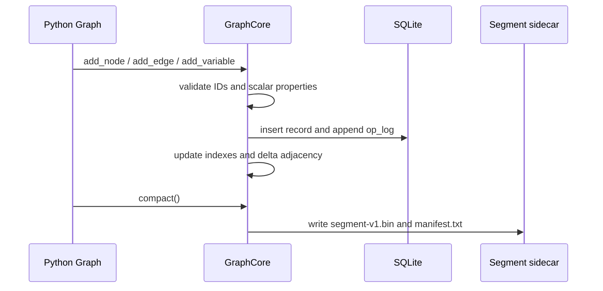

# Persistence

TongGraph can run entirely in memory or against a local SQLite file. The SQLite
backend is a source of truth for metadata and records, while compacted compute
segments are stored in sidecar files next to the database.

## What SQLite Stores

SQLite tables are initialized in `src/sqlite.rs` and cover:

- graph nodes and edges
- node and edge property rows
- property key/value catalogs
- operation log entries
- variables and ordered variable states
- factor metadata and factor tables
- latest posteriors
- evidence and traces

!!! info "Storage format marker"
    The metadata table records `storage_format = tonggraph-sqlite-v1`.

!!! warning "Pre-v1 storage compatibility"
    TongGraph does not promise stable SQLite tables or segment formats before
    v1. Treat local databases and `.segments/` directories as disposable
    pre-alpha artifacts unless your application owns its own export path.

## Segment Sidecars

Compacted adjacency segments are stored under:

```text
<database-path>.segments/
  manifest.txt
  segment-v1.bin
```

The manifest includes the segment format, node count, edge count, and segment
file name. When a graph reopens, TongGraph checks that the sidecar matches the
expected node and edge counts before loading it. If no usable segment exists,
the core rebuilds one from SQLite records.

## Write Flow



## Auto-Compaction

SQLite-backed graphs keep recent edge writes in a mutable delta overlay.
Compaction can happen manually through [`Graph.compact`](../api/graph.md#tonggraph.Graph.compact).
The core also auto-compacts when the delta overlay grows beyond the current
thresholds in `src/core/lifecycle.rs`.

## Operational Notes

- SQLite uses WAL journal mode and normal synchronous mode.
- Properties are limited to Python-compatible scalar values: `bool`, `int`,
  finite `float`, and `str`.
- Local `.db`, `.db-shm`, `.db-wal`, and `.segments/` artifacts are ignored by
  the repository.
- There is no network service, authentication layer, or distributed storage
  mode in the current codebase.
