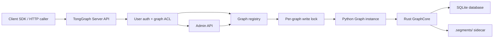

# TongGraph Server 中文开发文档

本文档用于规划 TongGraph 本地服务化能力的开发顺序。英文设计介绍见
[Local Server](../design/local-server.md)。

## 背景

TongGraph 当前是嵌入式 Python 包：应用通过 `import tonggraph` 直接创建
`Graph`，Rust core、SQLite 持久化、全文检索、向量检索和查询能力都在同一个
应用进程内运行。

Server 版本的目标不是替代嵌入式模式，而是在现有能力外面包一层本地网络服务：

```text
TongGraph Core / Python SDK
        |
        +-- 嵌入式模式：应用直接 import tonggraph
        |
        +-- 服务模式：tonggraph-server import tonggraph，再通过 HTTP API 对外提供能力
```

这样可以让多个本地进程、不同语言客户端、Agent 工具或前端应用访问同一个
TongGraph 图存储，而不需要每个客户端都直接打开 SQLite 文件。

当前规划的服务形态是：

> 单机部署，内网访问，多用户，多 graph，graph 级别权限隔离，管理员可动态创建 graph。

它不是分布式数据库，也不是公网多租户 SaaS 数据库。服务端可以识别用户，并判断
用户是否有权限访问某个 graph，但所有 graph 仍然由一台机器上的一个服务进程管理。

## 已确定的产品决策

- Server 作为可选 extra 发布，例如 `tonggraph[server]`，避免嵌入式用户安装服务依赖。
- Graph name 不只来自静态配置，管理员可以通过管理 API 动态创建 graph。
- 第一版需要管理员用户和管理 API。
- Token 支持两种来源：环境变量和配置文件明文 token。
- 远程事务第一版优先支持“单请求事务块”，暂不做长生命周期远程事务资源。
- Python HTTP client 第一版优先返回 plain dict / JSON-compatible 数据，后续再考虑轻量 record class。
- 第一版继续使用 HTTP JSON，不做 gRPC。
- 向量检索仍按 exact scan 设计，第一版面向中小规模内网服务；P2D 已用 benchmark 明确推荐规模边界。

## P0 完成情况

P0 已实现。当前实现包括：

- `tonggraph[server]` optional extra。
- `tonggraph-server` 和 `python -m tonggraph.server` 启动入口。
- FastAPI/Uvicorn HTTP server。
- YAML/JSON 配置加载。
- `token_env` 和明文 `token`。
- Bearer token 用户识别。
- admin/read/write graph 级权限。
- 管理员动态创建 graph、列出 graph、授予和撤销 graph 权限。
- 动态 graph 和 grants 持久化到 `<data_dir>/server-state.json`。
- graph name 安全字符校验，动态 graph 文件由服务端生成并限制在 `data_dir` 下。
- 每个 graph 一个专属 worker 线程，`Graph(path)` 只在该线程中创建和使用，避免 PyO3 unsendable 对象跨线程。
- node/edge CRUD、count、ID scan、label/type/property lookup。
- full-text index lifecycle 和 search。
- vector index lifecycle、upsert/get/delete/search。
- structured query、Cypher autocommit、单请求 Cypher transaction block。
- 稳定 JSON 错误响应。
- P0 HTTP 集成测试。

## P1 完成情况

P1 已实现。当前实现包括：

- traversal endpoints：`neighbors`、`k_hop`、`frontier`。
- runtime algorithm endpoints：BFS、shortest path、connected components、PageRank、random walk。
- `subgraph()` endpoint，并把返回的 `GraphSnapshot` 序列化为 JSON-compatible 结构。
- `compute_batch()` endpoint，支持 batch 结果里包含算法结果和 subgraph snapshot。
- batch vector search endpoint，对齐 `Graph.search_vectors()`。
- TTL-bound read-only snapshot endpoints。
- Snapshot 创建、列出、删除。
- Snapshot stats/schema、node/edge count、node/edge IDs、get node/edge。
- Snapshot structured query、read-only Cypher、`compute_batch()`、batch vector search。
- Snapshot 资源只保存在对应 graph worker 线程内，不写入 `server-state.json`。
- Snapshot ID 为 UUID，默认 TTL 为 600 秒，最大 TTL 为 3600 秒。
- Snapshot 归创建用户所有；管理员可以列出或删除 graph 下所有 snapshot。
- Snapshot 权限：创建和读取需要 graph `read` 权限；删除需要 owner 或 admin。
- Worker 异常返回会剥离 traceback，避免 PyO3 unsendable snapshot 对象被异常 traceback 带到其他线程释放。
- P1 HTTP 集成测试。

## P2A 完成情况

P2A 已实现。当前实现包括：

- `tonggraph.server.client.TongGraphClient` 同步 Python HTTP client。
- `RemoteGraph` 和 `RemoteSnapshot`，通过 HTTP 调用已实现的 server API。
- 使用 Python 标准库 `urllib`，不新增运行时依赖。
- client 返回 plain dict/list/JSON-compatible 数据，不封装成本地 `Node`、`Edge` 或 `CypherResult` class。
- 覆盖 service/admin、graph lifecycle、node/edge CRUD、检索、query、Cypher、compute 和 snapshot API。
- `TongGraphServerError` 映射 server JSON 错误，保留 `code`、`message`、`status_code`、`graph`、`request_id`。
- `tonggraph.server` 使用 lazy import，导入 client symbol 不会立刻导入 FastAPI app。
- P2A client 集成测试使用真实本地 Uvicorn server。

## P2B 完成情况

P2B 已实现并已做独立本地提交。提交信息为：

```text
feat(server): add operations metrics and request logging
```

当前实现包括：

- `operations` 配置段：`request_logging`、`request_timeout_seconds`、`metrics`。
- 请求日志：method、path、status、duration、request id、user id、graph name。
- 响应头：`x-request-id` 和 `x-tonggraph-elapsed-ms`。
- JSON metrics endpoint：`GET /metrics`。
- token auth 模式下 `/metrics` 需要 admin；`auth.mode: none` 时允许本地开发直接访问。
- metrics 包含请求计数、错误计数、in-flight 数、status/route/method 计数、latency、uptime。
- metrics 包含 graph summary：configured/open graph 数，以及已打开 graph 的 node/edge/snapshot 数。
- server-side request timeout：超时返回稳定 JSON error，`code=timeout`，HTTP 504。
- ASGI lifespan shutdown 会调用 registry 关闭 graph worker，释放 open 状态。
- P2B operations 集成测试。

## P2C 完成情况

P2C 已实现。当前实现包括：

- `server.routes.inference`，把概率传播和 belief propagation 相关 SDK 能力暴露为 HTTP API。
- 读权限 endpoint：`propagate()`、`local_propagate()`、变量/因子/证据/trace 读取、`posterior()`、active subgraph 编译、`persist=false` 的 belief propagation。
- 写权限 endpoint：创建 variable、factor、factor table、CPD、evidence、trace，以及 `persist=true` 的 belief propagation。
- inference 请求 schema：概率传播、变量、因子、factor table、CPD、证据、trace、active subgraph、belief propagation。
- `Variable`、`Factor`、`Evidence`、`Trace` 的 JSON-compatible 序列化。
- Python HTTP client wrappers：`propagate()`、`local_propagate()`、`add_variable()`、`get_variable()`、`posterior()`、`add_factor()`、`get_factor()`、`add_factor_table()`、`add_cpd()`、`add_evidence()`、`get_evidence()`、`add_trace()`、`get_trace()`、`compile_active_subgraph()`、`belief_propagation()`。
- P2C server/client 集成测试覆盖概率传播、BP、权限和 Python client workflow。

当前已知边界：

- P2E 已实现 token 轮换和基础用户管理接口。
- Python client 是同步 client，不负责启动或管理 server 进程。
- Timeout 在 ASGI 请求层生效，不会强行杀掉已经进入 native/Rust 层的 graph worker 操作。
- Snapshot 是内存资源，不会跨 server restart 保留。
- P2C 暂不提供 snapshot inference endpoints；inference API 作用于 live graph。
- Cypher 读写判断使用关键字启发式；复杂 Cypher 权限策略后续需要加强。
- 向量检索仍为 exact scan；P2D benchmark 建议 10k vectors/index 适合交互式本地/内网使用，100k vectors/index 更适合作为较高延迟、低 QPS 或批处理层级。

## 总体原则

第一版 server 应该坚持本地优先、单机优先、内网可用、复用核心能力：

- 服务进程持有 `Graph(path)` 实例。
- 客户端通过 HTTP API 访问服务。
- 每个图由一个服务进程负责写入。
- 服务端识别用户，并按 graph 授权访问。
- 权限先做到 graph 级别：`read` 或 `write`。
- 管理员可以创建 graph，并为用户授予或撤销 graph 权限。
- 动态创建的 graph 文件必须限制在 `data_dir` 下。
- SQLite 和 `.segments/` sidecar 继续作为本地持久化格式。
- API 尽量贴近现有 Python SDK，避免重新发明一套数据库语言。
- 第一版不做分布式、不做公网 SaaS 多租户、不做内置 embedding 生成。

## 适用场景

优先支持：

- 本机 daemon 服务。
- 局域网或内网私有服务。
- 内网多用户共享一个 TongGraph Server。
- 不同用户访问自己的 graph，或以只读方式访问共享 graph。
- 管理员按需为项目、用户或 Agent 创建新的 graph。
- Agent memory / GraphRAG / 本地知识图谱服务。
- 多个进程共享同一个本地图存储。
- 非 Python 客户端通过 HTTP 使用 TongGraph。

暂不优先支持：

- 高并发公网数据库服务。
- 多租户 SaaS 托管。
- 分布式图数据库。
- 大规模 ANN 向量库。
- 复杂权限、审计、配额和计费体系。
- 节点、边、label、property 级别的细粒度权限。

## 推荐架构



核心组件：

| 组件 | 职责 |
|---|---|
| Server extra | 通过 `tonggraph[server]` 安装 HTTP 服务依赖 |
| Server entry point | 启动 HTTP 服务，加载配置，初始化 graph registry |
| Auth middleware | 识别用户 token，并生成 request context |
| Access controller | 判断用户是否可以读写目标 graph |
| Admin API | 管理员创建 graph、列出 graph、授予或撤销 graph 权限 |
| Graph registry | 管理 graph name 到 SQLite path、worker 和动态创建的 graph |
| Graph worker | 每个 graph 一个专属线程，在线程内创建并使用 Python `Graph` 实例 |
| Operation queue | 对同一个 graph 的操作串行化，避免 PyO3 `Graph` 跨线程使用 |
| API router | 将 HTTP 请求映射到现有 `Graph` 方法 |
| Error mapper | 将 Python/Rust 异常转换成稳定 JSON 错误 |
| Client SDK | 可选，封装 HTTP 调用并提供接近 `Graph` 的接口 |

## 代码落点和文件结构

Server 第一版应主要落在 Python 包内，作为 `tonggraph[server]` 的可选能力实现。核心原则是：

- 不复制 `Graph` 逻辑，不重新实现存储、查询、索引或算法。
- Server 只负责 HTTP、配置、认证、权限、并发保护、错误映射和生命周期管理。
- 第一版尽量不改 Rust core；只有当现有 Python SDK 缺少必要能力时，才补 PyO3/Rust 接口。
- 嵌入式用户继续只使用 `tonggraph.Graph`，不会因为 server 依赖而变重。

推荐文件结构：

```text
python/tonggraph/
  __init__.py
  helpers.py
  query.py
  server/
    __init__.py
    __main__.py          # 支持 python -m tonggraph.server
    cli.py               # tonggraph-server 命令入口
    app.py               # 创建 ASGI app，组装 middleware 和 routes
    config.py            # 配置加载、校验、路径解析
    auth.py              # token 解析、用户身份、admin 判断
    access.py            # graph ACL，read/write/admin 权限判断
    registry.py          # GraphRegistry，管理 graph worker、动态创建、server-state
    errors.py            # 统一错误类型和 HTTP 错误映射
    schemas.py           # 请求/响应模型，保持 JSON-compatible
    serialization.py     # Node/Edge/CypherResult 等对象转 JSON
    routes/
      __init__.py
      health.py          # /health
      admin.py           # /admin/graphs, grants
      graphs.py          # graph lifecycle, schema, stats
      records.py         # nodes/edges CRUD
      retrieval.py       # label/type/property lookup, fulltext, vector
      query.py           # structured query, Cypher, transaction block
      compute.py         # traversal, algorithms, subgraph, compute_batch
      snapshots.py       # TTL-bound read-only snapshot endpoints
      inference.py       # P2: propagate 和 belief propagation
    client.py            # P2A: Python HTTP client，第一版返回 dict/list
```

测试和文档建议落点：

```text
tests/
  server/
    test_health.py
    test_auth_acl.py
    test_admin_graphs.py
    test_records.py
    test_retrieval.py
    test_query.py
    test_concurrency.py
    test_errors.py

docs/
  design/local-server.md
  development/local-server-development.zh.md
  examples/local-server.md
```

打包配置建议：

```toml
[project.optional-dependencies]
server = [
    "fastapi>=0.115",
    "uvicorn[standard]>=0.30",
    "pydantic>=2",
    "PyYAML>=6",
]

[project.scripts]
tonggraph-server = "tonggraph.server.cli:main"
```

依赖选择可以在实现前再确认，但建议第一版使用成熟 ASGI 生态：FastAPI/Starlette 负责路由和请求校验，Uvicorn 负责本地服务启动。

### 模块职责

| 模块 | 职责 | P0/P1 |
|---|---|---:|
| `server.cli` | 解析命令行参数，加载配置，启动 Uvicorn | P0 |
| `server.app` | 创建 app，注册 middleware、exception handlers、routes | P0 |
| `server.config` | 读取 YAML/JSON 配置，解析 `data_dir`、graphs、users、tokens | P0 |
| `server.auth` | 从 `Authorization` header 解析 token，得到 `user_id` 和 admin 标记 | P0 |
| `server.access` | 判断用户对 graph 是否有 `read`、`write` 或 `admin` 权限 | P0 |
| `server.registry` | 持有 per-graph worker、动态创建 graph、持久化 server-state | P0 |
| `server.errors` | 把认证、权限、Graph 异常映射成稳定 JSON 错误 | P0 |
| `server.serialization` | 把 SDK record/result 转成可 JSON 序列化结构 | P0 |
| `server.routes.health` | health check 和基本元信息 | P0 |
| `server.routes.admin` | 管理员创建 graph、授权、撤销授权 | P0 |
| `server.routes.records` | node/edge CRUD | P0 |
| `server.routes.retrieval` | fulltext/vector/property lookup | P0 |
| `server.routes.query` | structured query、Cypher、单请求事务块 | P0/P1 |
| `server.routes.compute` | traversal、algorithms、`subgraph()`、`compute_batch()` | P1 |
| `server.routes.snapshots` | TTL-bound read-only snapshot lifecycle、读取、查询和计算 | P1 |
| `server.routes.inference` | probability transfer、BP | P2C |
| `server.client` | Python HTTP client，返回 JSON-compatible dict/list | P2A |

### GraphRegistry 设计要点

`GraphRegistry` 是 server 层最重要的状态对象，当前实现集中负责：

- 从配置初始化 graph name 到 SQLite path 的映射。
- 动态创建 graph，并生成安全的数据库路径。
- 延迟或立即打开 graph worker。
- 每个 graph 一个 `GraphWorker`，由 worker 线程创建并持有 `Graph(path)`。
- 所有 graph 操作通过队列提交给对应 worker，同一 graph 内天然串行。
- 保护 graph registry 本身的并发修改。
- 提供 close、refresh、compact 等生命周期操作。

实际内部模型类似：

```text
GraphRegistry
  graphs: dict[str, GraphEntry]

GraphEntry
  name: str
  path: Path
  worker: GraphWorker | None
  created_by: str | None

GraphWorker
  thread: Thread
  tasks: Queue
  graph: Graph  # 仅存在于 worker 线程内
```

动态 graph 和 grants 已持久化到 server metadata 文件：

```text
<data_dir>/server-state.json
```

该文件只保存 server 控制面状态，不保存图数据本身。图数据仍然保存在每个 graph 对应的 SQLite 和 `.segments/` 文件中。

### P0 实现顺序建议

1. 增加 `tonggraph[server]` optional extra 和 `tonggraph-server` 入口。
2. 建立 `server.config`、`server.errors`、`server.app`、`server.routes.health` 最小骨架。
3. 实现 token auth、admin 标记和 graph ACL。
4. 实现 `GraphRegistry`，支持配置 graph 和管理员动态创建 graph。
5. 实现 node/edge CRUD 和基础读取。
6. 实现 fulltext/vector endpoints。
7. 实现 structured query endpoint。
8. 补齐 P0 HTTP 集成测试和错误响应测试。

## 开发优先级总览

| 能力 | 优先级 | 说明 |
|---|---:|---|
| Server optional extra | P0 | `tonggraph[server]` 安装服务依赖和入口 |
| 健康检查和元信息 | P0 | health check、版本、已打开图数量 |
| Graph 配置和注册 | P0 | graph name 到 SQLite path 的映射 |
| 管理员和管理 API | P0 | admin 用户、创建 graph、授权 graph |
| 基础用户识别 | P0 | loopback 可关闭认证，内网用 static token |
| Graph 级权限 | P0 | 用户到 graph 的 read/write 授权 |
| 图生命周期 | P0 | open、close、compact、refresh |
| 节点和边 CRUD | P0 | add/update/delete/get nodes and edges |
| 基础检索 | P0 | counts、ID 扫描、label/type/property lookup |
| 全文检索 | P0 | index lifecycle、search_text |
| 向量检索 | P0/P1 | index lifecycle、vector upsert/get/delete/search，P1 补齐 search-batch |
| 结构化查询 | P0 | `Graph.query()` |
| Cypher 子集 | P0 | autocommit `cypher()`、单请求事务块 |
| 遍历和算法 | P1 已完成 | neighbors、k_hop、frontier、BFS、shortest path、PageRank、random walk |
| Snapshot | P1 已完成 | TTL-bound read-only snapshot 查询和计算 |
| Python HTTP Client | P2A 已完成 | 接近嵌入式 SDK 的同步客户端接口，第一版返回 dict/list |
| 认证增强 | P2E 已完成 | 动态用户、禁用用户、token rotation、用户管理辅助接口 |
| Exact vector benchmark | P2D 已完成 | 10k/100k exact scan 基准和规模建议 |
| 可观测性 | P2B 已完成 | 请求日志、耗时、错误计数、graph metrics |
| 概率传播和 BP | P2C 已完成 | propagate、local_propagate、belief_propagation |
| 备份/导出 | P3A 已完成 | SQLite + sidecar 本地备份/恢复；记录导出待后续 |
| 高级权限 | P3 | per-graph token、角色或 scope |
| ANN 向量检索 | P3 | 可选 HNSW/ANN backend |

## P0：最小可用内网多用户服务

目标：证明 TongGraph 可以作为稳定的单机内网服务运行，并且能区分用户和 graph 权限。

必须交付：

- `tonggraph[server]` optional extra。
- `tonggraph-server` 启动入口。
- 配置文件支持 `host`、`port`、`data_dir`、graph name 到 SQLite path 的映射。
- 配置文件支持 users、tokens、管理员标记、每个用户可访问的 graph 和权限。
- Token 支持 `token_env` 和明文 `token` 两种写法。
- 默认绑定 `127.0.0.1`。
- 内网部署时支持 bearer token，并能识别当前用户。
- 管理员 API：创建 graph、列出 graph、授予或撤销用户对 graph 的权限。
- 动态创建 graph 时校验 graph name，并把 SQLite 文件限制在 `data_dir` 下。
- 请求进入具体 graph 前先检查权限。
- Health endpoint，返回服务状态和已打开图数量。
- 图生命周期 endpoint：open、close、compact、refresh。
- 节点和边 CRUD endpoint。
- 基础读取 endpoint：node_count、edge_count、node_ids、edge_ids、get_node、get_edge。
- label、edge type、property lookup endpoint。
- 全文索引创建、删除、重建和搜索 endpoint。
- 向量索引创建、删除、vector upsert/get/delete/search endpoint。
- 结构化查询 endpoint，对应 `Graph.query()`。
- 每个 graph 一个写锁，写操作串行化。
- 稳定 JSON 错误格式。
- 使用临时 SQLite 数据库的 HTTP 集成测试。

验收标准：

- 启动服务后，客户端可以创建图、写节点边、建立全文和向量索引并执行检索。
- 管理员可以通过 API 创建新 graph，并给用户授予 read 或 write 权限。
- 普通用户不能创建 graph 或修改权限。
- 重启服务后，同一个 SQLite 图可以重新打开，数据仍然存在。
- 同一个图的并发写请求不会破坏状态。
- 不直接 import `tonggraph` 的客户端也能通过 HTTP 使用服务。
- 用户 A 不能访问未授权的 graph。
- read-only 用户不能执行写操作。

## P1：核心 SDK 能力覆盖

目标：让 server 成为当前嵌入式 SDK 的远程形态。

必须交付：

- traversal endpoints：`neighbors`、`k_hop`、`frontier`。
- algorithm endpoints：BFS、shortest path、connected components、PageRank、random walk。
- `subgraph` 和 `compute_batch()` endpoint。
- Cypher autocommit endpoint。
- 单请求事务块 endpoint：在一个 HTTP 请求内执行多条 Cypher，成功则提交，失败则回滚。
- Snapshot 创建、读取、查询和计算 endpoint。
- 对 snapshot 的写操作明确拒绝。
- Graph lifecycle endpoint 也执行权限检查，例如只有 write 权限用户可以 compact。
- 请求参数校验尽量贴近 Python SDK 行为。
- 文档示例覆盖常见 HTTP 工作流。

暂不做：

- 长生命周期远程事务资源。
- gRPC API。

验收标准：

- 现有 Python SDK 测试中的主要场景可以用 HTTP 集成测试表达。
- Snapshot 在后续写入后保持稳定。
- Cypher 写入、查询和错误行为与嵌入式模式一致。
- 单请求事务块在失败时不会留下部分写入。

## P2：运维和开发体验

目标：让服务更适合内网应用和 Agent 系统长期运行。

必须交付：

- Python HTTP client，常用方法名尽量贴近 `Graph`，第一版返回 dict / JSON-compatible 数据。已在 P2A 完成。
- token 轮换或更清晰的 token 加载方式。已在 P2E 完成。
- 请求日志：request id、user id、graph name、路径、耗时、状态码。已在 P2B 完成。
- Metrics endpoint：请求数、错误数、图数量、节点边数量、snapshot 数。已在 P2B 完成。
- Graceful shutdown：等待正在执行的写操作完成后关闭 graph。已在 P2B 完成。
- 请求超时配置。已在 P2B 完成。
- 概率传播 endpoint：`propagate()`、`local_propagate()`。已在 P2C 完成。
- BP endpoint：variables、factors、evidence、belief_propagation。已在 P2C 完成。
- 配置文档和示例配置文件。
- Exact vector search benchmark：至少覆盖 10k 和 100k vectors/index 的本地基准。已在 P2D 完成。

验收标准：

- 默认配置适合本地安全运行，不会意外暴露到外网。
- 客户端应用可以在嵌入式 `Graph` 和 HTTP client 之间较低成本切换。
- 长时间运行的计算或推理请求有清晰超时和错误返回。
- 文档明确 exact vector search 的推荐规模和性能边界。

## P2D 完成情况

P2D 已实现。当前实现包括：

- `tests.benchmark.gbench.vector` exact vector benchmark。
- 同一份 deterministic SQLite graph 同时测 embedded `Graph.search_vector()` / `search_vectors()` 和 TongGraph Server HTTP vector search / search-batch。
- 默认配置：128 维、cosine、20 个 query vectors、`limit=10`、3 repeats。
- smoke test 使用小规模数据进入测试；10k/100k benchmark 只作为手动本地性能记录，不进入默认 pytest。
- 本机结果记录在英文 benchmark 示例文档中。
- 推荐边界：10k vectors/index 适合交互式本地/内网服务；100k vectors/index 已是较高延迟 exact-scan 层级，适合低 QPS 或批处理。

## P2E 完成情况

P2E 已实现。当前实现包括：

- 管理员用户管理 API：列出用户、查看用户、创建用户、更新用户、删除动态用户。
- token rotation API：管理员可传入新 token，或由服务端生成 URL-safe token 并仅在响应中返回一次。
- disabled 用户状态；禁用后 token 认证失败，重新启用后恢复。
- 动态用户状态持久化到 `<data_dir>/server-state.json` 的 `users` 段。
- 配置文件用户仍作为 bootstrap 用户；动态 state 可覆盖其 token/admin/disabled，但不能删除配置身份。
- Python HTTP client wrappers 覆盖用户管理和 token rotation。
- P2E server/client 集成测试覆盖认证、授权、轮换、禁用、删除和重启恢复。

P2 当前已基本收口，后续工作进入 P3 或按真实使用反馈补强。

## P3A 完成情况

P3A 已实现。当前实现包括：

- 管理员 graph backup API，把 SQLite 主文件、可选 WAL/SHM、`.segments/` sidecar 和 `metadata.json` 写入 `<data_dir>/backups/{backup_id}.tar.gz`。
- 管理员 backup list/delete API。
- 管理员 restore API，支持恢复为新 graph，或 `overwrite=true` 覆盖现有 graph。
- restore 后可附加 graph grants，并把动态 graph 写入 `server-state.json`。
- 备份前会在 graph worker 内执行 `compact()`，随后短暂关闭该 graph worker，以获得一致的文件级备份。
- Snapshot 是内存 TTL 资源，不进入备份；restore 后没有旧 snapshot。
- Python HTTP client wrappers 覆盖 backup/list/restore/delete backup。
- P3A server/client 集成测试覆盖归档内容、恢复读取、覆盖、授权、删除和重启恢复。

## P3：规模化和强化

这些能力应该等真实使用反馈明确后再做。

候选方向：

- 图数据导入导出格式。
- 只读副本或只读 graph mode。
- per-graph token 或 role-based access control。
- 后台 compaction 调度。
- 可选 ANN/HNSW 向量检索 backend。
- 更完整的 Cypher 兼容层。
- Docker image 和发布产物。
- 更完整的用户/权限管理控制面，例如多 token、角色、审计和外部身份系统。
- Python client 轻量 record class。
- gRPC API。

## API 设计建议

第一版可以使用 JSON over HTTP。路径可以按 graph name 分组：

```text
GET  /health
GET  /graphs

POST /admin/graphs
GET  /admin/graphs
POST /admin/graphs/{graph}/grants
DELETE /admin/graphs/{graph}/grants/{user}

POST /graphs/{graph}/open
POST /graphs/{graph}/compact
POST /graphs/{graph}/refresh

POST /graphs/{graph}/nodes
GET  /graphs/{graph}/nodes/{node_id}
PATCH /graphs/{graph}/nodes/{node_id}
DELETE /graphs/{graph}/nodes/{node_id}

POST /graphs/{graph}/edges
GET  /graphs/{graph}/edges/{edge_id}
PATCH /graphs/{graph}/edges/{edge_id}
DELETE /graphs/{graph}/edges/{edge_id}

POST /graphs/{graph}/fulltext/indexes
POST /graphs/{graph}/fulltext/{index}/search

POST /graphs/{graph}/vector/indexes
PUT  /graphs/{graph}/vector/{index}/{entity_id}
POST /graphs/{graph}/vector/{index}/search
POST /graphs/{graph}/vector/{index}/search-batch

POST /graphs/{graph}/query
POST /graphs/{graph}/cypher
POST /graphs/{graph}/cypher/transaction
```

路径只是初稿，真正实现前可以根据 FastAPI/Starlette 的路由习惯再调整。

## 错误响应格式

建议所有错误统一为：

```json
{
  "error": {
    "code": "node_not_found",
    "message": "node 42 not found",
    "graph": "default",
    "request_id": "req_..."
  }
}
```

建议保留的错误码：

- `unauthenticated`
- `permission_denied`
- `admin_required`
- `graph_not_found`
- `graph_not_open`
- `graph_already_exists`
- `invalid_request`
- `node_not_found`
- `edge_not_found`
- `index_not_found`
- `conflict`
- `write_required`
- `snapshot_read_only`
- `timeout`
- `internal_error`

## 配置建议

第一版配置可以保持显式、可读，优先服务内网多用户场景：

```yaml
host: 127.0.0.1
port: 8719
data_dir: .tonggraph
graphs:
  alice_memory: alice.db
  bob_memory: bob.db
  shared_kg: shared.db
auth:
  mode: token
  users:
    admin:
      admin: true
      token_env: TONGGRAPH_ADMIN_TOKEN
      graphs:
        "*": write
    alice:
      token: alice-dev-token
      graphs:
        alice_memory: write
        shared_kg: read
    bob:
      token_env: TONGGRAPH_BOB_TOKEN
      graphs:
        bob_memory: write
        shared_kg: read
```

规则：

- 相对路径默认解析到 `data_dir` 下。
- 客户端默认只能访问配置里声明或管理员创建的 graph name。
- `auth.mode: none` 只建议用于 `127.0.0.1` 本机开发。
- 绑定内网地址或 `0.0.0.0` 时建议要求 `auth.mode: token`。
- token 可以来自 `token_env`，也可以来自明文 `token`。
- 明文 token 适合小型内网或本机开发；如果配置文件会提交或共享，应优先使用 `token_env`。
- 管理员用户可以创建 graph 和修改 graph grants。
- 普通用户只能访问授权列表中的 graph。
- `read` 权限可以执行读取、检索、查询和算法；`write` 权限额外允许 CRUD、索引写入、compact、refresh 等写操作。
- 动态创建 graph 时，graph name 必须只包含安全字符，例如字母、数字、`_`、`-`。
- 动态创建 graph 的 SQLite 文件由服务端生成路径，客户端不能传任意文件路径。
- 绑定 `0.0.0.0` 时应该在日志中给出安全提示。

## 用户和 Graph 权限模型

第一版不要做复杂权限系统，建议采用简单的 graph ACL：

```text
user_id
  -> graph_name: read | write
```

请求处理流程：

1. 从 `Authorization: Bearer ...` 读取 token。
2. 根据 token 找到 `user_id`。
3. 从 URL 中解析 `graph_name`。
4. 检查用户是否有访问该 graph 的权限。
5. 根据 endpoint 类型判断是否需要 write 权限。
6. 权限通过后再调用对应的 `Graph` 方法。

权限边界：

- `read`：允许 get、list、search、query、cypher read、traversal、algorithm、snapshot read。
- `write`：包含 read，并允许 add/update/delete、index lifecycle、vector writes、compact、refresh、cypher write。
- `admin`：允许创建 graph、列出所有 graph、管理用户、轮换 token、授予或撤销 graph 权限。
- 暂不支持节点、边、label、property 级别的细粒度权限。
- 暂不支持普通用户自助创建 graph。

## 并发模型

第一版采用保守策略：

- 一个 graph 一个 worker thread。
- `Graph(path)` 只在该 worker thread 内创建、使用和释放。
- 同一 graph 的读写请求都通过 worker queue 串行执行。
- 不同 graph 之间可以并行处理。
- 管理员创建 graph 或修改 graph grants 时，需要保护 graph registry 和 ACL 状态。

这个模型牺牲一些吞吐，但符合当前 SQLite + embedded core 的设计，也更容易保证正确性。

## 测试策略

P0 必须有 HTTP 层集成测试：

- 服务启动和 health check。
- `tonggraph[server]` 依赖和 `tonggraph-server` 入口可用。
- bearer token 用户识别。
- `token_env` 和明文 `token` 都可用。
- 管理员创建 graph。
- 管理员授予和撤销 graph 权限。
- graph ACL：允许访问、拒绝访问、read-only 拒绝写入。
- graph open、close、restart、reopen。
- node/edge CRUD。
- full-text index lifecycle 和 search。
- vector index lifecycle、upsert、delete、search。
- structured query。
- 同一个 graph 的并发写入。
- 错误响应格式。

P1 继续补：

- Cypher autocommit。
- 单请求 Cypher transaction block。
- Snapshot 稳定性。
- Graph 和 GraphSnapshot 的 batch vector search。
- traversal 和 algorithm endpoint 与嵌入式 SDK 行为一致。
- `compute_batch()`。

当前状态：P1 已完成；P2A/P2B/P2C/P2D/P2E 也已完成。后续主要进入 P3，或根据真实部署反馈补强。

## 暂缓问题

这些问题已经有第一版倾向，但不作为 P0/P1 阻塞项：

- 长生命周期远程事务：暂缓，先做单请求事务块。
- Python client record class：暂缓，先返回 dict。
- gRPC：暂缓，先使用 HTTP JSON。
- ANN/HNSW：暂缓，P2D 已先 benchmark exact scan。
- 更完整的用户管理：暂缓，第一版通过配置定义用户，管理员 API 先管理 graph 和 grants。
